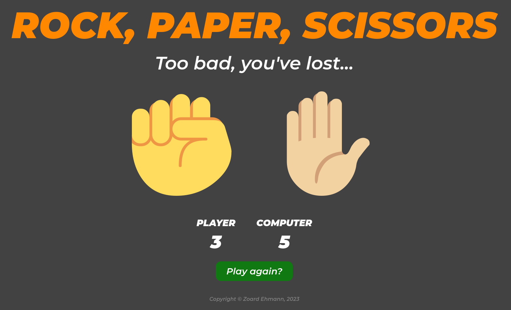

# Odin: Rock, Paper, Scissors

## Name

The Odin Project: Rock, Paper, Scissors

## Description

Simple implementation of grade-school classic [_Rock, Paper, Scissors_](https://en.wikipedia.org/wiki/Rock_paper_scissors) game.

This implementation uses JavaScript at its core for game logic. The front-end part uses HTML and CSS to provide a simple UI for the end-user.

Check the [algorithm](algorithm/algorithm.md) page for further information about the implementation logic.

## Visuals

## Usage

1. Copy the absolute path of the _index.html_ file to the browser
2. Choose your symbol
   - First who gets 5 points, wins
3. Click on _Play again?_ when game stops and you would like to play again

## Roadmap

1. Create a console version of the game with JS ✔
2. Create a GUI for the console version with HTML and CSS ✔
