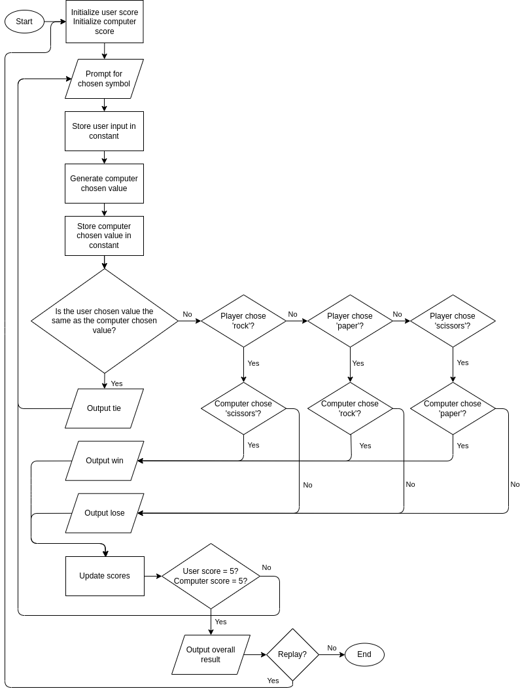

# Algorithm: Rock, Paper, Scissors

## Console version

### Plan

#### UI

- Does the program will have a UI?
  - The program will have a console interface at first.
- How will it look like?
  - The console interface won't have graphics, it will contain only textual information.
- What functionality will it has?
  - The interface will accept a user input that refers to the chosen symbol.
  - The interface will have a replay functionality.
  - The interface will have a counter that keeps track of the score.

#### Inputs

- What inputs the program will have?
  - A string that will select the chosen symbol: _String_
  - Replay value: _Boolean_
- Will the program get the inputs from the user or elsewhere?
  - The program will get the string input from the user in each turn.
  - The program will get the replay value from the user after declaring the winner.

#### Outputs

- What will be the desired output?
  - The desired output will be a result (from player perspective): win, lose or tie.

#### Steps

- What will be the steps necessary to return the desired output based on the inputs?
  1. Get the user input
  2. Generate a random computer chosen value
  3. Check the user input against the computer chosen value
  4. Determine the result
  5. Inform the user about the result

### Pseudocode

- Start the main loop
  - Start the game
    - Initialize score tracking for player and computer
    - Start a loop that continues for either: 5 rounds OR 3 scores (for player or computer)
      - Prompt for a player input, validate it, and store it in a variable
      - Generate a random choice for the computer and store it in a variable
      - Check the player input against the computer chosen value
      - Determine the result from player perspective: win, lose or tie
        - Inform the player about the result
        - Update the scores
        - Show the score table
    - Inform the player about the overall result
  - Prompt the player for replay

### Flowchart

